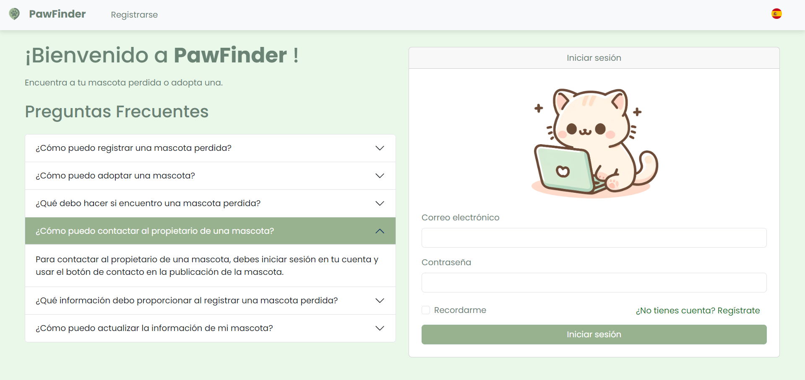
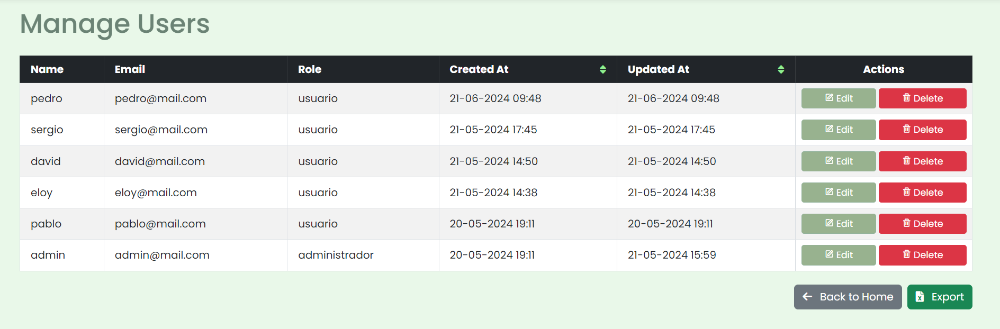
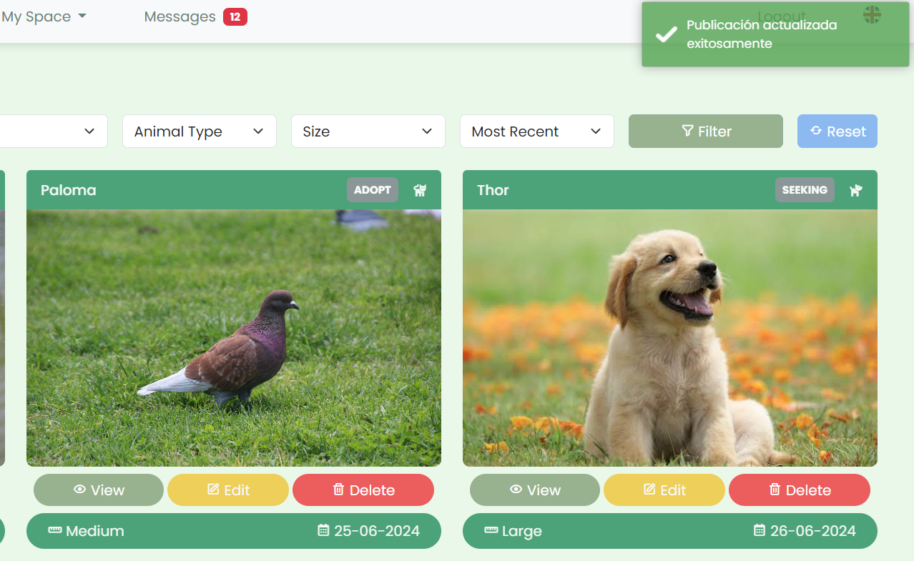

  <h1>PawFinder - Enrique Torrella</h1>
  

### Descripción del Proyecto 🎓
El proyecto PawFinder consiste en una aplicación web diseñada para agilizar los procesos de adopción de mascotas y gestión de animales perdidos. Para asegurar el éxito del proyecto, se ha optado por seguir una metodología waterfall, que permite avanzar de manera progresiva y garantizar la coherencia entre cada etapa cumplida y las anteriores. 

La aplicación se apoya principalmente en el framework Laravel, utilizando plantillas Blade, y emplea tecnologías como PHP, JavaScript y Leaflet. Ofrece características clave como registro de usuarios, autenticación de inicio de sesión, control de acceso basado en roles y mensajería entre usuarios. Los usuarios pueden crear, editar, actualizar, eliminar, reportar y marcar como favoritas las publicaciones de animales perdidos o en adopción. Los administradores tienen acceso completo a los datos de usuarios y publicaciones, con permisos para gestionarlos según sea necesario. La aplicación es multilingüe (castellano e inglés) y cuenta con un diseño adaptable para ofrecer una experiencia fluida en todos los dispositivos. 

Con PawFinder, se espera abordar de manera efectiva el creciente problema del extravío y abandono de animales al ofrecer una plataforma intuitiva y accesible para la adopción y gestión de mascotas perdidas. Se espera que esta iniciativa tenga un impacto significativo en la comunidad local y más allá, promoviendo la solidaridad y el cuidado responsable de los animales.

### Tecnologías Utilizadas
-  -----------------------> 10.48.10
-  ----------------------> 6.0
-  ------------------> 5.2.1
-  ----------------------> 10.11.7
-  ---------------------------> 8.1.10
-  ---------------------> 2.6.6
-  ------------------------> 2.4.54

 

> [!IMPORTANT]
> ### Funcionalidades Principales
> 
> #### 1. Visualización de Páginas
> - **Páginas disponibles para usuarios no registrados**: Los usuarios no registrados pueden visualizar el apartado de preguntas frecuentes (FAQ) y un mensaje de bienvenida.
> - **Páginas adicionales para usuarios registrados**: Los usuarios registrados tienen acceso a todas las secciones de la aplicación, incluyendo ‘Inicio’, ‘Publicaciones’, ‘Mis anuncios’, ‘Favoritos’, ‘Mi perfil’, ‘Mensajes’, ‘Administrador’ (solo para administradores), ‘Cerrar sesión’ y ‘Alternar idioma’.
> 
> #### 2. Visualización de Páginas Específicas
> - **Todas las páginas**: La aplicación muestra un conjunto de publicaciones, incluyendo el anuncio más reciente, el anuncio con más favoritos, y permite la creación de nuevas publicaciones desde cualquier sección accesible para usuarios registrados.
> 
> #### 3. Funcionalidades Específicas
> - **Registro de Usuario**: Permite a los usuarios registrarse proporcionando un nombre de usuario, correo electrónico, contraseña y número de contacto.
> - **Inicio de Sesión**: Permite a los usuarios iniciar sesión utilizando su correo electrónico y contraseña.
> - **Creación de Anuncios**: Los usuarios registrados pueden crear anuncios de animales perdidos o en adopción, especificando detalles como nombre del animal, tipo de publicación, tipo de animal, tamaño, imagen, fecha, última ubicación y descripción adicional.
> - **Gestión de Anuncios**: Los usuarios pueden editar y eliminar sus propios anuncios, así como marcar anuncios como favoritos para revisarlos posteriormente.
> - **Mensajería**: Los usuarios pueden contactar con los autores de los anuncios mediante mensajes que incluyen asunto, descripción breve y número de contacto.
> - **Reportes**: Los usuarios pueden reportar anuncios por contenido inapropiado, información incorrecta, spam u otras razones, y los administradores reciben notificaciones sobre estos reportes.
> - **Administrador**: Los administradores tienen acceso a una sección exclusiva donde pueden gestionar usuarios, publicaciones y reportes, así como eliminar usuarios y anuncios si es necesario.
> - **Exportación de Datos**: Los usuarios pueden exportar sus mensajes a una tabla tipo Excel, y los administradores pueden exportar tablas relativas al dashboard de ‘Usuarios’, ‘Publicaciones’ y ‘Reportes’.
> - **Multilingüe**: La aplicación está disponible en castellano e inglés, permitiendo a los usuarios alternar entre ambos idiomas.

> [!WARNING]
> ### Estructura de ficheros a destacar (Laravel 10.x)
> - 📁 `app/`
>   - 📁 `Console/`
>   - 📁 `Exceptions/`
>   - 📁 `Http/`
>     - 📁 `Controllers/`
>     - 📁 `Middleware/`
>     - 📁 `Requests/`
>     - 📁 `Mail/`
>   - 📁 `Models/`
> - 📁 `config/`
> - 📁 `database/`
>   - 📁 `migrations/`
>   - 📁 `seeders/`
> - 📁 `lang/`
> - 📁 `public/`
> - 📁 `resources/`
>   - 📁 `css/`
>   - 📁 `js/`
>   - 📁 `views/`
> - 📁 `routes/`
>   - 📄 `web.php`
> - 📄 `.env`
> - 📄 `composer.json`
> - 📄 `composer.lock`
> - 📄 `LICENSE.md`
> - 📄 `README.md`

> [!CAUTION] 
> ### Licencia
> Este proyecto está bajo la Licencia MIT. Consulta el archivo `LICENSE.md` para obtener más detalles. [MIT license](https://opensource.org/licenses/MIT).

> [!TIP]
> ### Instalación y Ejecución
> 1. Clona este repositorio: `git clone https://github.com/enrtorgil/EnriqueTorrellaLaravel.git`
> 2. Navega al directorio del proyecto: `cd pawFinder`
> 3. Instala las dependencias: `composer install` OR `php composer.phar install`
> 4. Generar clave de cifrado si fuera necesario `php artisan key:generate`
> 5. Configura el archivo `.env` con la información de tu base de datos.
> 5. Ejecuta las migraciones: `php artisan migrate`
> 6. Ejecuta la aplicación: `php artisan serve`
> 7. Abre tu navegador y visita `http://localhost:8000/` o host de prueba si lo hubiese.
> 8. Se recomienda desplegar desde Laragon. En ese caso acceder al dominio local `pawfinder.test`.

## Algunas capturas de pantalla

### Página de Inicio (usuario no autenticado)

### Gestión de Usuarios

### Mis Publicaciones

